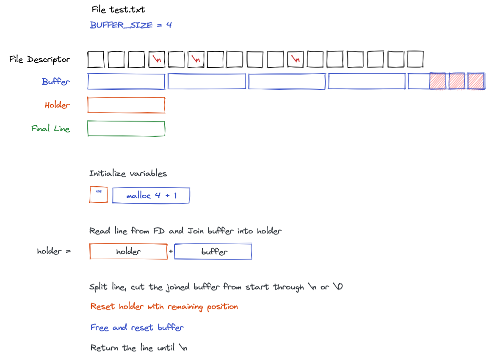

# 42-get-next-line

The purpose of this project is to create a function to read the next line from file descriptor.

I've used the logic read line -> join -> split the line -> reset

The big challenge is memory allocation, when we're working with buffers and static variables it's very easy to forget to free and "lost" memories between interations, so you need to track and guarantee that all memories have been freed and allocated in right order.

Function prototype:
```c
char	*get_next_line(int fd)
```
Return line read from file descriptor reading BUFFER_SIZE bytes from file descriptor. You can't read entire file then return, you need to print line by line.

Thinking in GNL:


## Tests
[Tripouille/gnlTester](https://github.com/Tripouille/gnlTester)

```c
...
int main()
{
    char *line;
    int fd;

    fd = open("./file-path", O_RDONLY);
    get_next_line(0, &line);
    printf("%s", line)
    free(line); // Remember to free your allocated variable
}
...
```

## Usage

```sh
gcc -Wall -Wextra -Werror -D BUFFER_SIZE=42 get_next_line.c get_next_line_utils.c
```
